# IChat — Giải thích flow hoạt động từ Frontend tới Backend

> Tài liệu dành cho người mới vào dự án. Đọc từ trên xuống là hiểu được: app này làm gì,
> một câu hỏi đi qua những chặng nào, và mỗi file nằm ở đâu trong bức tranh đó.

---

## Mục lục

1. [App này làm gì?](#1-app-này-làm-gì)
2. [Bản đồ toàn cảnh](#2-bản-đồ-toàn-cảnh)
3. [Kiến trúc Backend](#3-kiến-trúc-backend-net-10)
4. [Kiến trúc Frontend](#4-kiến-trúc-frontend-angular-22)
5. [Flow 1 — Upload tài liệu và Ingestion](#5-flow-1--upload-tài-liệu-và-ingestion)
6. [Flow 2 — Hỏi đáp RAG streaming (flow chính)](#6-flow-2--hỏi-đáp-rag-streaming-flow-chính)
7. [Bên trong Retrieval Pipeline](#7-bên-trong-retrieval-pipeline)
8. [Flow 3 — Retrieval Lab (soi pipeline)](#8-flow-3--retrieval-lab-soi-pipeline)
9. [Flow 4 — Settings và Reindex](#9-flow-4--settings-và-reindex)
10. [Cơ sở dữ liệu](#10-cơ-sở-dữ-liệu)
11. [Cấu hình và đổi nhà cung cấp AI](#11-cấu-hình-và-đổi-nhà-cung-cấp-ai)
12. [Xử lý lỗi, degrade, health check](#12-xử-lý-lỗi-degrade-health-check)
13. [Chạy thử và debug](#13-chạy-thử-và-debug)
14. [Bảng tra cứu file](#14-bảng-tra-cứu-file)
15. [Vài điểm cần lưu ý](#15-vài-điểm-cần-lưu-ý)

---

## 1. App này làm gì?

IChat là một **chatbot RAG** (Retrieval-Augmented Generation) trên kho tài liệu nội bộ.

Ý tưởng RAG rất đơn giản:

> LLM không biết tài liệu nội bộ của bạn. Vậy thì trước khi hỏi nó, ta **đi tìm** vài đoạn
> văn bản liên quan nhất trong kho tài liệu, **nhét vào prompt**, rồi bảo nó *"chỉ được trả
> lời dựa trên những đoạn này, và phải ghi rõ trích từ đoạn nào"*.

Nhờ đó câu trả lời (a) bám vào tài liệu thật, (b) có trích dẫn `[1] [2]` bấm vào xem được
đoạn gốc, và (c) khi không tìm thấy thì nói thẳng là không có, thay vì bịa.

App có 4 màn hình:

| Màn hình | Đường dẫn | Làm gì |
| --- | --- | --- |
| **Chat** | `/chat`, `/chat/:conversationId` | Hỏi đáp, câu trả lời chảy từng chữ, kèm panel nguồn trích dẫn |
| **Knowledge base** | `/documents` | Upload `.docx/.pdf/.md/.txt`, xem trạng thái xử lý, xóa |
| **Retrieval lab** | `/retrieval` | Chạy tìm kiếm thô, xem **từng chặng** của pipeline trả về gì |
| **Settings** | `/settings` | Xem provider/model đang chạy, đổi theme, bấm reindex |

---

## 2. Bản đồ toàn cảnh

Toàn bộ hệ thống là 3 container chạy bằng `docker compose` (file ở gốc repo):

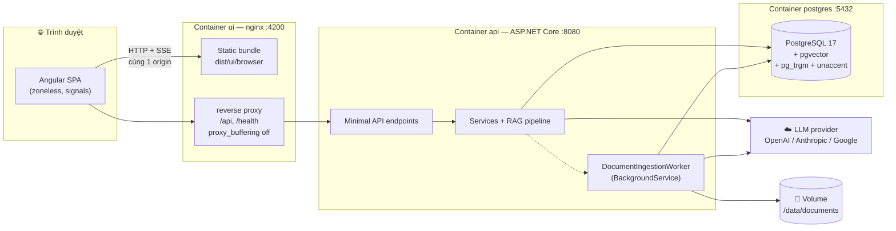

**Điểm quan trọng số 1:** trình duyệt **chỉ nói chuyện với một origin duy nhất** (`:4200`).
nginx trong container `ui` proxy `/api` và `/health` sang container `api`. Nhờ vậy backend
**không cần cấu hình CORS** một dòng nào. Khi dev bằng `ng serve`, `proxy.conf.json` làm
đúng việc đó, trỏ về `http://localhost:5140`.

**Điểm quan trọng số 2:** dòng `proxy_buffering off;` trong `ui/nginx-proxy.inc` là
*load-bearing*. Bật buffering thì nginx giữ các frame SSE lại đến khi response kết thúc —
câu trả lời sẽ hiện ra một cục ở cuối thay vì chảy từng chữ.

---

## 3. Kiến trúc Backend (.NET 10)

Ba project, phụ thuộc **một chiều**:

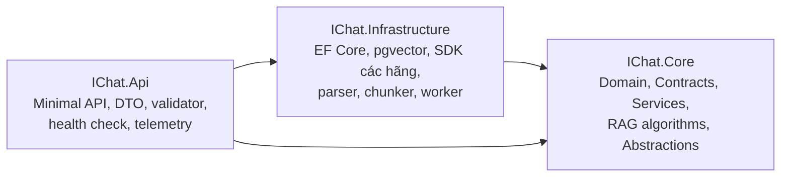

`IChat.Core` chỉ tham chiếu `Microsoft.Extensions.AI.Abstractions` và
`Microsoft.EntityFrameworkCore`. **Không có một dòng nào trong Core hay Api biết tới
OpenAI / Anthropic / Google.** Tên hãng chỉ xuất hiện trong thư mục
`Infrastructure/Ai/Providers/` — **mỗi hãng một file**, và `ChatClientFactory` /
`EmbeddingGeneratorFactory` chỉ còn là *cửa vào*: đọc config, tra bảng theo enum provider,
rồi uỷ quyền xuống đúng một factory của hãng đó.

### Quy ước code (khác với "Clean Architecture kinh điển")

Dự án cố tình **không dùng** MediatR, CQRS, AutoMapper, generic repository. Thay vào đó:

- Mỗi mảng nghiệp vụ = **một service**: `DocumentService`, `ConversationService`,
  `ChatService`, `SearchService`, `AdminService`.
- Interface nằm ở `IChat.Core/Abstractions`, endpoint `inject` interface rồi **gọi thẳng method**.
- Service nào phình quá thì tách **collaborator nội bộ**, không đẻ thêm interface: `ChatService`
  giờ là một **Facade** chỉ giữ mạch truyện SSE, còn việc nặng nằm ở `Services/Chat/` —
  `ChatTurnContextBuilder` (history → viết lại → retrieval → ghép context), `AnswerGenerator`
  (gọi model, timeout, telemetry, buffer) và `ChatTurnRecorder` (ghi message + citation).
  Cả ba đăng ký DI bằng **kiểu cụ thể**, đúng tiền lệ `RetrievalPipeline` / `ContextAssembler`.
- Lỗi nghiệp vụ trả về bằng `Result<T>` chứ **không ném exception**.
- Lỗi HTTP trả theo RFC 7807 (ProblemDetails) kèm `traceId`; message gốc của SDK
  **không bao giờ lộ ra client**.

### Luồng một request điển hình

```mermaid
sequenceDiagram
    autonumber
    participant C as Client
    participant M as Middleware<br/>(Serilog, RateLimiter,<br/>ExceptionHandler)
    participant E as Endpoint
    participant V as FluentValidation
    participant S as Service (Core)
    participant DB as EF Core / Postgres

    C->>M: HTTP request
    M->>E: định tuyến
    E->>V: ValidateAsync(dto)
    alt không hợp lệ
        V-->>C: 400 ValidationProblem
    else hợp lệ
        E->>S: dto.ToServiceRequest()
        S->>DB: truy vấn / ghi
        DB-->>S: dữ liệu
        S-->>E: Result&lt;T&gt;
        alt Result.IsFailure
            E-->>C: ProblemDetails (404/415/…)
        else thành công
            E-->>C: 200/201/202 + DTO response
        end
    end
```

Chuỗi biến đổi dữ liệu luôn là: **DTO (Api) → Request (Core) → Domain → View (Core) → Response (Api)**.
Mapping viết tay trong các file `Mappings/*Mapper.cs` — không AutoMapper.

### Đăng ký endpoint

`Program.cs` gọi đúng một dòng `app.MapIChatEndpoints()`. Bên trong
`EndpointRouteBuilderExtensions.cs` là **nơi duy nhất gắn prefix version**:

```
/health/live, /health/ready        ← hạ tầng, không version
/api/v1/providers                  ← Admin
/api/v1/admin/reindex              ← Admin
/api/v1/documents…                 ← Documents
/api/v1/search                     ← Search
/api/v1/conversations…             ← Conversations
```

---

## 4. Kiến trúc Frontend (Angular 22)

Angular **standalone + zoneless + signals**, không dùng NgRx hay bất kỳ thư viện state nào.

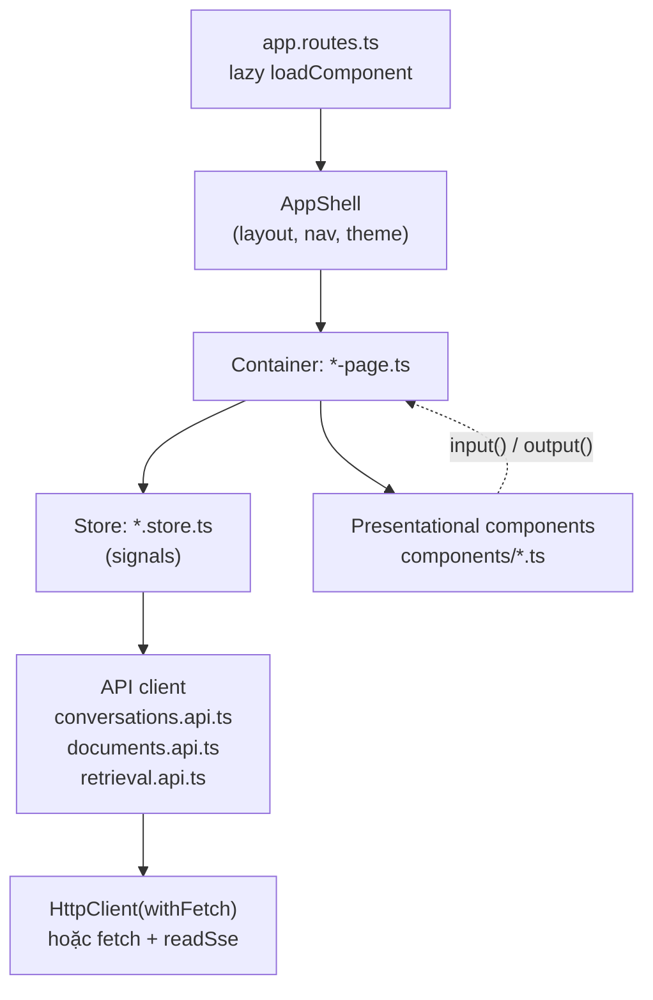

### Quy tắc Container vs Presentational

Thư mục nói lên vai trò của component:

| | **Container** | **Presentational** |
| --- | --- | --- |
| Ở đâu | `<feature>/<feature>-page.ts`, `layout/app-shell.ts` | bất kỳ thư mục `components/` nào |
| Được `inject()` | store, `Router`, `DestroyRef` | không gì ngoài `ElementRef` |
| Biết về | HTTP, route, toast, state app | chỉ input của chính nó |
| Giao tiếp | đọc store, gọi method của store | `input()` vào, `output()` ra |

Hai quy ước giữ cho phía presentational "sạch":

- **Route link là dữ liệu.** `ConversationList` render thẻ `<a>` thật, nhưng mỗi item nhận
  sẵn `link: ['/chat', id]` từ container. Middle-click / "mở tab mới" vẫn chạy, mà component
  vẫn không biết route nào tồn tại.
- **Side effect là request.** `MessageTurn` không đụng clipboard; nó `emit('copyRequest')`,
  container mới thực hiện và bắn toast.

Template nằm ở file `.html` anh em cạnh file `.ts` (`upload-progress.ts` → `upload-progress.html`)
để có tooling HTML thật. Ngoại lệ: `AnswerContent` có template rỗng vì nó gắn
`DocumentFragment` đã sanitise một cách imperative.

### Stores

| Store | Scope | Ghi chú |
| --- | --- | --- |
| `ChatStore` | `providedIn: 'root'` | sidebar và route chat dùng chung một danh sách hội thoại |
| `DocumentsStore` | provide bởi container | vòng đời gắn với route |
| `RetrievalStore` | provide bởi container | |
| `SettingsStore` | provide bởi container | |

Container **không bao giờ gọi API client trực tiếp** — luôn đi qua store, nên "state nằm ở đâu"
không bao giờ là câu hỏi.

---

## 5. Flow 1 — Upload tài liệu và Ingestion

Đây là flow phải hiểu **trước**, vì không có tài liệu đã index thì chat không có gì để trả lời.

```mermaid
sequenceDiagram
    autonumber
    participant U as Người dùng
    participant P as DocumentsPage
    participant S as DocumentsStore
    participant A as DocumentsApi
    participant EP as POST /api/v1/documents
    participant DS as DocumentService
    participant FS as LocalFileStorage
    participant Q as Channel&lt;Guid&gt;
    participant W as DocumentIngestionWorker
    participant DB as Postgres

    U->>P: chọn file
    P->>S: upload(file)
    S->>A: POST multipart/form-data<br/>(reportProgress: true)
    A->>EP: file + title
    EP->>EP: validate (đuôi, dung lượng)
    EP->>DS: UploadAsync
    DS->>DS: đọc 8 byte đầu → kiểm magic bytes
    Note over DS: content-type client khai báo KHÔNG đáng tin
    alt định dạng không hỗ trợ
        DS-->>U: 415 Unsupported Media Type
    else OK
        DS->>FS: SaveAsync(stream)
        DS->>DB: INSERT documents (status = Pending)
        DS->>Q: EnqueueAsync(documentId)
        EP-->>S: 202 Accepted { id, status: "Pending" }
    end

    S->>S: bắt đầu poll list mỗi 3s

    Note over W,DB: chạy nền, độc lập với HTTP request
    W->>Q: DequeueAllAsync()
    W->>DB: status = Processing
    W->>FS: OpenReadAsync
    W->>W: parser.ParseAsync → ParsedDocument (Blocks)
    W->>W: HeadingAwareChunker.Chunk
    W->>W: BatchingEmbeddingService.EmbedAsync (theo lô 64)
    W->>DB: BEGIN; DELETE chunks cũ; INSERT chunks mới;<br/>status = Indexed, chunk_count = N; COMMIT
    S->>A: poll GET /api/v1/documents
    A-->>P: status = "Indexed", chunkCount = N
    S->>S: hết việc đang chạy → dừng poll
```

### Tại sao trả 202 chứ không phải 200?

Parse + embedding có thể mất hàng chục giây. Nếu làm đồng bộ trong request, HTTP sẽ timeout.
Nên endpoint chỉ **lưu file + đẩy id vào hàng đợi** rồi trả `202 Accepted` ngay; UI poll
`GET /api/v1/documents` mỗi 3 giây cho đến khi không còn document nào ở trạng thái
`Pending`/`Processing`.

Vòng đời trạng thái:

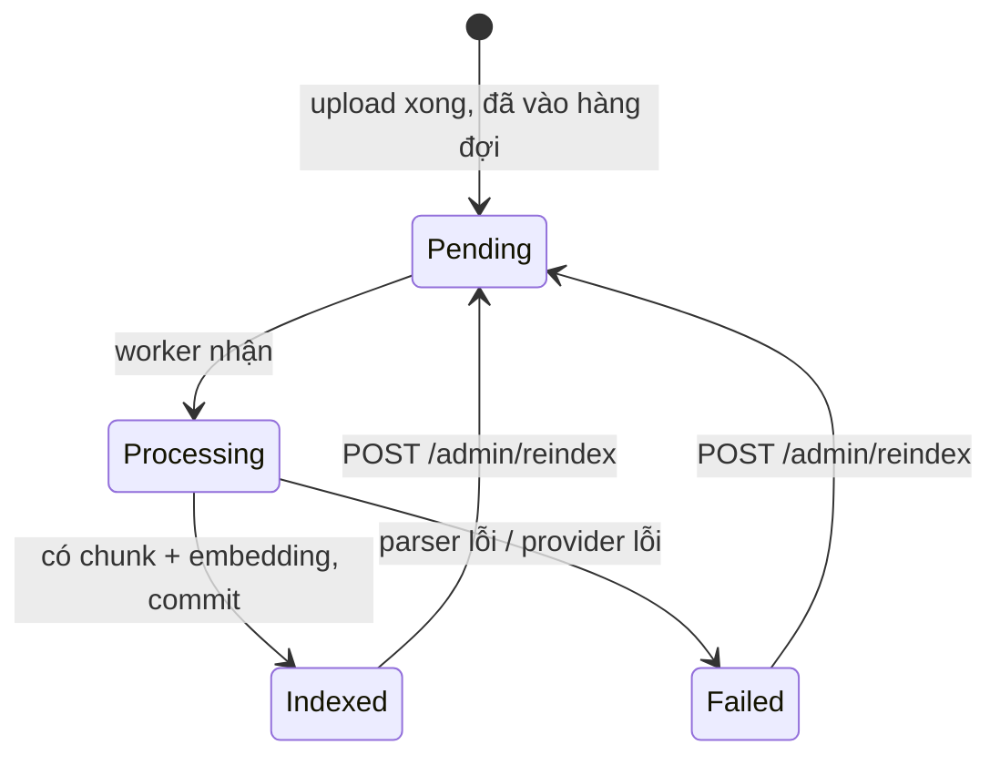

### Hàng đợi

`DocumentIngestionQueue` là một `Channel<Guid>` **bounded 100**, `FullMode = Wait`:

- **Bounded** để một đợt upload lớn không thổi bay bộ nhớ.
- **Wait** (thay vì DropWrite) để endpoint upload *chờ* chứ không âm thầm vứt tài liệu đi.

Đây là hàng đợi **in-process**: restart container là mất. Đủ cho một node; muốn bền thì phải
đổi sang một message broker thật.

### Parse → Chunk → Embed

**Parser** được chọn theo *đuôi file + magic bytes*, không tin `Content-Type` client gửi:

| Định dạng | Parser | Xử lý đặc biệt |
| --- | --- | --- |
| `.docx` | `DocxDocumentParser` | Bỏ `w:del` giữ `w:ins` (tracked changes); fallback `w:outlineLvl` khi style không khớp `^Heading[1-9]$`; duyệt riêng `w:txbxContent`; bảng thành một `Block(Table)` nguyên khối; bỏ header/footer/TOC |
| `.pdf` | `PdfDocumentParser` | có `metadata.page` |
| `.md` | `MarkdownDocumentParser` | |
| `.txt` | `PlainTextDocumentParser` | |
| `.doc` | — | Trả **415** kèm hướng dẫn lưu lại thành `.docx`, không bao giờ 500 |

**Chunker** (`HeadingAwareChunker`) cắt theo **cây heading trước**, và *không bao giờ cắt
ngang qua ranh giới heading*.

> Cắt mù theo dấu câu là nguyên nhân phổ biến nhất khiến retrieval trả về chunk vô nghĩa:
> chunk thứ 47 đứng một mình thì không ai biết nó nói về cái gì.

Mặc định: `TargetTokens 800`, `OverlapTokens 120`, `MinTokens 80`.

Mỗi chunk lưu **hai** phiên bản text:

- `content` — text gốc, cái sẽ hiện cho người đọc.
- `embedded_text` — `"<Tiêu đề tài liệu> > <heading path>\n\n<content>"`, cái đem đi embed.

Việc thêm tiền tố heading path trước khi embed là **thay đổi rẻ nhất và hiệu quả nhất** trong
cả pipeline: nó cho vector biết chunk này thuộc ngữ cảnh nào.

**Embedding** đi qua `BatchingEmbeddingService`, gom theo lô (mặc định 64) để giảm số round-trip.

Cuối cùng toàn bộ ghi trong **một transaction**: xóa chunk cũ → chèn chunk mới → đặt
`Indexed`. Reindex vì thế không bao giờ để lại trạng thái nửa vời.

---

## 6. Flow 2 — Hỏi đáp RAG streaming (flow chính)

Đây là flow trung tâm của app. Đọc kỹ phần này.

```mermaid
sequenceDiagram
    autonumber
    participant U as Người dùng
    participant CP as ChatPage
    participant CS as ChatStore
    participant API as ConversationsApi
    participant SSE as readSse (fetch)
    participant EP as POST /conversations/{id}/messages
    participant CH as ChatService
    participant QR as LlmQueryRewriter
    participant RP as RetrievalPipeline
    participant CA as ContextAssembler
    participant LLM as IChatClient
    participant DB as Postgres

    U->>CP: gõ câu hỏi, Enter
    CP->>CS: send(question)
    alt chưa có hội thoại nào mở
        CS->>API: POST /conversations
        API-->>CS: { id }
    end
    CS->>CS: pending = { question }, tạo AbortController
    CS->>API: streamAnswer(id, {content}, signal)
    API->>SSE: fetch POST, Accept: text/event-stream
    SSE->>EP: request

    EP->>CH: StreamAnswerAsync(request, ct)
    CH->>CH: validate; kiểm hội thoại tồn tại;<br/>kiểm model có trong allowlist
    CH-->>SSE: event: status { stage: "rewriting" }
    SSE-->>CS: patch pending.stage

    CH->>DB: nạp N lượt hội thoại gần nhất
    CH->>QR: RewriteAsync(câu hỏi, history)
    Note over QR: dùng utility model (rẻ);<br/>lỗi → fallback về câu gốc
    QR-->>CH: rewrittenQuery

    CH-->>SSE: event: status { stage: "retrieving" }
    CH->>RP: ExecuteAsync(rewrittenQuery, Hybrid)
    RP-->>CH: PipelineOutcome (contexts, stages, degraded)

    CH->>CA: Assemble(contexts, MaxTokens=6000)
    CA-->>CH: AssembledContext (sources [1..n] + rendered text)

    CH->>DB: INSERT message (User) + rewritten_query + retrieval_ms
    Note over CH,DB: lưu TRƯỚC khi stream, để mất kết nối vẫn còn câu hỏi
    CH->>DB: đặt tên hội thoại nếu còn là tên mặc định

    CH-->>SSE: event: sources { [1..n] }
    SSE-->>CS: hiện panel nguồn NGAY, trước khi có chữ nào
    CH-->>SSE: event: status { stage: "generating" }

    CH->>LLM: GetStreamingResponseAsync(prompt)
    loop mỗi token
        LLM-->>CH: ChatResponseUpdate
        CH-->>SSE: event: delta { text }
        SSE-->>CS: queueDelta → gộp, flush theo requestAnimationFrame
    end

    CH->>CH: CitationExtractor.Extract(answer, sourceCount)
    Note over CH: loại marker ngoài phạm vi + marker trong code block
    CH->>DB: INSERT message (Assistant) + message_citations
    CH-->>SSE: event: done { messageId, citations, provider, model,<br/>tokens, latencyMs, retrievalMs, degraded, interrupted }
    SSE-->>CS: commitTurn → đẩy 2 message vào thread, xóa pending
```

### Bốn loại SSE event

| Event | Payload | UI làm gì |
| --- | --- | --- |
| `status` | `{ stage }` — `rewriting` \| `retrieving` \| `generating` | đổi dòng trạng thái, để người dùng không nhìn màn hình đứng im |
| `sources` | `{ sources: [...] }` — **tất cả** những gì lọt vào context | render panel nguồn ngay |
| `delta` | `{ text }` | nối vào câu trả lời đang chảy |
| `done` | metadata + `citations` — **chỉ những gì câu trả lời thực sự trích** | chốt lượt, hiện provider/model/token/latency |
| `error` | `{ code, message }` | hiện lỗi ngay trong thread, kèm nút gửi lại |

**Rất quan trọng — phân biệt `sources` và `citations`:**

- `sources` (event `sources`) = **mọi thứ đi vào context**. Model *nhìn thấy* chừng đó.
- `citations` (trong event `done`) = **những đoạn câu trả lời thật sự có `[n]` trỏ tới**,
  và đã được xác minh.

### Vì sao lỗi lại trả HTTP 200?

Nhìn `ConversationEndpoints.SendMessage` sẽ thấy nó **không validate DTO**. Lý do:

> Mọi lỗi của một lượt chat đều đi qua kênh SSE dưới dạng event `error` với HTTP **200**.

Bởi vì header HTTP đã gửi đi từ trước khi biết có lỗi hay không — không thể quay lại đổi
status code giữa chừng một stream. Nên `ChatService` là **nơi duy nhất** quyết định lỗi, và
client chỉ cần xử lý một kênh.

### Hai câu hỏi, hai mục đích — bẫy dễ sai nhất

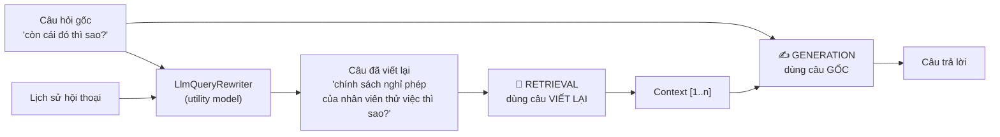

Comment trong `PromptBuilder` nói rõ:

> *Câu hỏi đưa vào đây phải là câu hỏi GỐC của người dùng. Bản viết lại chỉ phục vụ
> retrieval — dùng nhầm sẽ khiến câu trả lời lệch khỏi điều người dùng thật sự hỏi.*

Viết lại câu hỏi tồn tại để giải quyết đại từ ("cái đó", "họ", "vấn đề này") — thứ mà
embedding không thể hiểu. Nhưng nếu đem bản viết lại đi *sinh câu trả lời*, model sẽ trả lời
một câu hỏi mà người dùng không hề hỏi.

Viết lại bị **bỏ qua ở lượt đầu** (`SkipOnFirstTurn`) vì chưa có đại từ nào để giải quyết —
tiết kiệm một round-trip.

### Prompt gửi lên LLM

```
[System] You are an assistant that answers questions from internal documents.
         - Answer only from the CONTEXT provided...
         - Every claim must carry an [n] marker...
         - If the CONTEXT is not enough, say plainly that the information was not found...
         - Answer in the same language as the user's question.

[System] CONTEXT:
         [1] (source: Sổ tay nhân sự > Chế độ nghỉ phép)
         <nội dung chunk + hàng xóm>

         [2] (source: ...)
         ...

[User]      …lịch sử hội thoại đã chuẩn hóa…
[Assistant] …
[User]      <câu hỏi GỐC>
```

Hai chi tiết:

- Nếu provider **không hỗ trợ nhiều system message** (`SupportsMultipleSystemMessages = false`),
  hai khối system được gộp làm một.
- Nếu retrieval **không tìm được gì**, dùng `NoContextSystemPrompt` — bảo model nói thẳng là
  không tìm thấy, tuyệt đối không bịa.

### Xác minh trích dẫn — không tin model

Marker `[n]` do model sinh ra **không được tin**. Sau khi stream xong, `CitationExtractor`:

1. Parse toàn bộ marker `[n]` trong câu trả lời.
2. **Loại** marker nằm ngoài phạm vi `1..sourceCount` (và ghi log cảnh báo — đó là dấu hiệu
   prompt có vấn đề).
3. **Loại** marker nằm trong code block (`[1]` trong đoạn code không phải trích dẫn).
4. Chỉ ghi vào `message_citations` những chunk thực sự được trích.

Một khối context có thể gộp nhiều chunk gốc (do neighbor expansion); citation trỏ về
**chunk neo** (`AnchorChunkIds`), chunk hàng xóm chỉ làm giàu ngữ cảnh chứ không thành
citation độc lập.

### Người dùng bấm Stop hoặc đóng tab

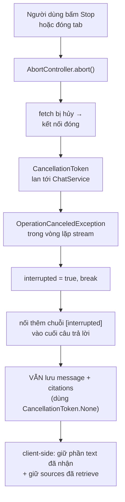

Chi tiết đáng chú ý: `PersistAssistantMessageAsync` được gọi với **`CancellationToken.None`** —
token đã bị hủy rồi, nếu truyền xuống thì việc ghi DB cũng chết theo và mất sạch phần đã sinh.

### Phía client — vì sao phải gom delta?

`ChatStore.queueDelta()` **không** ghi thẳng vào signal. Nó dồn vào buffer rồi flush trong
`requestAnimationFrame`:

> Câu trả lời được parse lại thành markdown mỗi lần thay đổi, mà một provider nhanh bắn token
> dày đặc hơn nhiều so với tốc độ refresh của màn hình.

Không gom thì mỗi token gây một lần re-parse markdown + re-render — UI giật.

### Vì sao tự viết SSE reader thay vì dùng `EventSource`?

`EventSource` **chỉ phát được GET**. Endpoint chat là **POST** (câu hỏi nằm trong body).
Nên `ui/src/app/core/api/sse.ts` tự parse wire format — đúng phần con mà API phát ra:
dòng `event:`, dòng `data:`, các frame ngăn nhau bằng dòng trống. Frame lạ bị **bỏ qua** chứ
không đoán, để một event type mới trong tương lai không làm sập client cũ.

---

## 7. Bên trong Retrieval Pipeline

Đây là "bộ não" tìm kiếm. `IChat.Core/Rag/RetrievalPipeline.cs`.

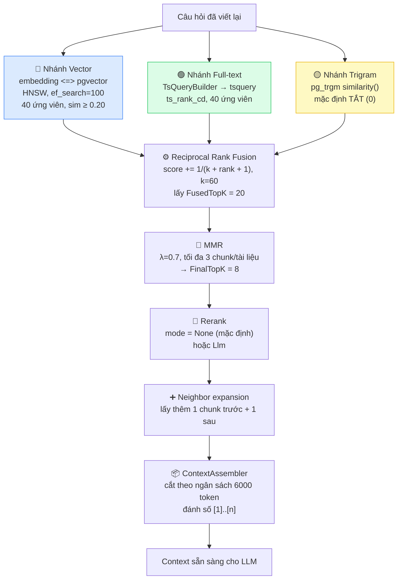

Ba nhánh chạy **song song** bằng `Task.WhenAll` — mỗi nhánh mở `DbContext` riêng vì `DbContext`
không thread-safe.

### Mỗi nhánh là một Strategy

Nhánh không còn là ba nhánh `if` trong pipeline: mỗi nhánh là một `IRetrievalBranch`
(`VectorSearchBranch`, `FullTextSearchBranch`, `TrigramSearchBranch` trong
`Infrastructure/Search/Branches/`), tự khai báo tên chặng và tự trả lời "mode này có bật tôi
không". **Thêm một nhánh mới = thêm một class + một dòng DI**, không phải sửa `RetrievalPipeline`.

> ⚠️ **Thứ tự đăng ký DI là contract.** `IEnumerable<T>` của .NET trả về theo đúng thứ tự đăng ký,
> và Retrieval Lab đọc các chặng theo thứ tự `vector, fulltext, trigram`. Đổi thứ tự ba dòng
> `AddScoped<IRetrievalBranch, …>` trong `Infrastructure/DependencyInjection.cs` là đổi thứ tự
> chặng trong response của `/api/v1/search`. `RetrievalStageOrderTests` chốt lại điều này.

Nhánh **bị tắt vẫn ghi một chặng rỗng**: Retrieval Lab phân biệt "chặng chạy mà không ra gì" với
"chặng không tồn tại", nên trigram (mặc định `TrigramCandidates = 0`) vẫn xuất hiện với `count = 0`.

Nhánh vector tự ôm luôn việc tạo embedding và **tự báo `Degraded = true`** khi embedding hỏng —
pipeline không cần biết gì về chuyện embedding.

Truy vấn SQL của cả ba nhánh nằm trong `PostgresChunkStore`, implement hai interface tách theo
động từ: `IChunkSearch` (`Search*Async`, chỉ nhánh dùng) và `IChunkLoader` (`Load*Async`, chỉ
pipeline dùng).

### Vì sao cần cả 3 nhánh?

| Nhánh | Mạnh ở | Yếu ở |
| --- | --- | --- |
| Vector | ý nghĩa, diễn đạt khác từ ("nghỉ phép" ↔ "ngày nghỉ có lương") | mã số, tên riêng, ký hiệu chính xác |
| Full-text | từ khóa chính xác, mã hiệu, tên riêng | diễn đạt khác từ |
| Trigram | lỗi chính tả, gần đúng | ồn, nên mặc định tắt |

### RRF là *fusion*, không phải *rerank*

```
score(chunk) = Σ  1 / (k + rank_trong_danh_sách + 1)     với k = 60
             các danh sách có chunk đó
```

RRF chỉ **trộn nhiều danh sách đã xếp hạng** dựa trên *thứ hạng*, chứ **không chấm lại độ liên quan**.
Chunk vắng mặt trong một nhánh **không bị phạt** — chỉ đơn giản là không cộng điểm từ nhánh đó.

Rerank thật cần một cross-encoder hoặc một LLM chấm lại — đó là `IReranker` với mode `Llm`
(mặc định `None`).

### MMR — chống trùng lặp

Chỉ lấy top-8 theo điểm sẽ hay ra 8 đoạn gần như giống hệt nhau từ cùng một trang.
Maximal Marginal Relevance cân bằng *liên quan* và *đa dạng*:

```
MMR = λ · relevance − (1 − λ) · max_similarity_với_những_cái_đã_chọn
```

`λ = 0.7` (nghiêng về liên quan), thêm ràng buộc cứng **tối đa 3 chunk mỗi tài liệu**.

### Neighbor expansion

Chunk trúng có thể bị cắt giữa một ý. Lấy thêm 1 chunk **trước** và 1 chunk **sau** (theo
`chunk_index` trong cùng document) rồi ghép lại thành một khối context liền mạch.

Chunk hàng xóm **không** trở thành citation độc lập — chỉ chunk neo mới được trích dẫn.

### ContextAssembler

Sắp xếp theo điểm giảm dần, cắt theo ngân sách token, và **luôn cắt trọn chunk**:

> Nửa chunk không có ngữ cảnh thì vô dụng với cả embedding lẫn LLM.

Chunk đầu tiên luôn được giữ dù có vượt ngân sách (`kept.Count > 0 &&` trong điều kiện bỏ qua),
để không bao giờ trả về context rỗng khi rõ ràng có kết quả.

### Bẫy đã xử lý: `plainto_tsquery` giết nhánh full-text

`plainto_tsquery` và `websearch_to_tsquery` nối **mọi** lexeme bằng `&`. Một câu hỏi 15 từ
sẽ đòi một chunk chứa **đủ cả 15** lexeme → nhánh full-text gần như luôn rỗng. Hệ thống vẫn
chạy, vẫn trả lời, và người vận hành **tưởng** hybrid search đang hoạt động trong khi thực ra
chỉ có nhánh vector làm việc.

Đo thật trên PostgreSQL với một chunk rõ ràng khớp:

| Cách dựng tsquery | Kết quả |
| --- | --- |
| `plainto_tsquery` (AND trên 10 lexeme) | **0 dòng** |
| `TsQueryBuilder` (OR + lọc stopword) | 1 dòng, `ts_rank_cd` = 1.0 |

Đo trên golden set 29 câu: **tỉ lệ nhánh full-text rỗng = 0/29 = 0.0%**.

`TsQueryBuilder` cố tình **không** đưa vào danh sách stopword những từ mà sau khi bỏ dấu sẽ
đụng với từ nội dung phổ biến: `moi` ← "môi trường", `tai` ← "tài liệu", `nen` ← "nền tảng",
`ai` ← "AI", `dau` ← "đầu vào". Giữ lại một lexeme yếu vẫn tốt hơn là mất một từ nội dung.

### Bẫy đã xử lý: `unaccent()` không IMMUTABLE

Cột generated `content_tsv` **không thể tạo** trực tiếp: generated column đòi biểu thức
IMMUTABLE, mà `unaccent()` chỉ STABLE. Migration tạo một wrapper trước:

```sql
CREATE OR REPLACE FUNCTION immutable_unaccent(text)
RETURNS text LANGUAGE sql IMMUTABLE PARALLEL SAFE STRICT
AS $$ SELECT public.unaccent('public.unaccent', $1) $$;
```

Và liên quan: `InvariantGlobalization` được đặt **`false` một cách có chủ đích**. Bật nó lên
thì `String.Normalize` trở thành no-op **im lặng**, `TsQueryBuilder` không bỏ dấu được, và
nhánh full-text không khớp gì trong cột đã bỏ dấu.

---

## 8. Flow 3 — Retrieval Lab (soi pipeline)

Màn hình `/retrieval` gọi `POST /api/v1/search` — cùng `RetrievalPipeline` với chat, nhưng
**không sinh câu trả lời**. Nó trả về kết quả của **từng chặng**, để debug xem chunk rơi rụng
ở đâu.

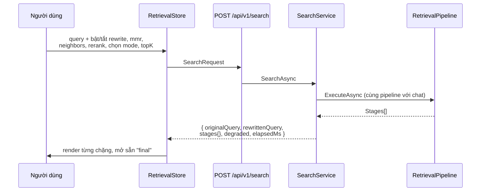

Mỗi chặng trả về `{ name, count, elapsedMs, tsQuery?, top[] }`. Chặng `fulltext` còn trả về
**chính chuỗi tsquery đã dựng** — cực kỳ hữu ích khi full-text không ra kết quả.

Các chặng backend phát ra: `vector`, `fulltext`, `trigram`, `fused`, `afterMmr`,
`reranked` (chỉ khi rerank bật), `final`.

---

## 9. Flow 4 — Settings và Reindex

**`GET /api/v1/providers`** trả về provider/model đang chạy cho ba vai trò:

```json
{
  "chat":        { "provider": "OpenAI", "model": "gpt-4o-mini" },
  "utilityChat": { "provider": "OpenAI", "model": "gpt-4o-mini" },
  "embedding":   { "provider": "OpenAI", "model": "text-embedding-3-small" },
  "allowedChatModels": []
}
```

> **Không bao giờ trả về API key, kể cả dạng che dấu.**

**`POST /api/v1/admin/reindex`** đặt mọi document về `Pending` và đẩy lại vào hàng đợi,
trả `202`. Dùng khi đổi model embedding hoặc đổi tham số chunking.

---

## 10. Cơ sở dữ liệu

PostgreSQL 17 với extension `vector` (pgvector), `pg_trgm`, `unaccent`.

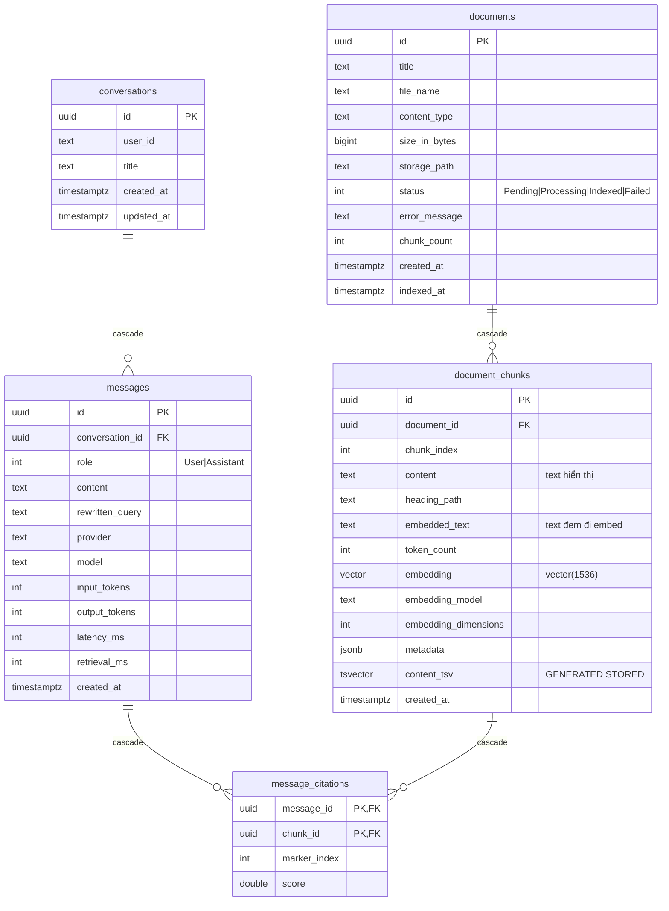

### Cột `content_tsv`

```sql
content_tsv tsvector GENERATED ALWAYS AS (
  to_tsvector('simple', immutable_unaccent(coalesce(heading_path,'') || ' ' || content))
) STORED
```

Ba quyết định trong một dòng:

- **`'simple'`** chứ không phải `'english'`/`'vietnamese'`: không stemming sai ngôn ngữ.
- **`immutable_unaccent`**: bỏ dấu, để "nghỉ phép" khớp "nghi phep".
- **gộp cả `heading_path`**: tiêu đề mục cũng tìm được.

### Các index

| Index | Kiểu | Dùng cho |
| --- | --- | --- |
| `ix_chunks_embedding_hnsw` | HNSW trên `embedding` | nhánh vector |
| `ix_chunks_tsv` | GIN trên `content_tsv` | nhánh full-text |
| `ix_chunks_content_trgm` | GIN trigram trên `content` | nhánh trigram |
| `ix_document_chunks_document_id_chunk_index` | B-tree | neighbor expansion |
| `ix_documents_status`, `ix_documents_created_at` | B-tree | list + filter |
| `ix_messages_conversation_id_created_at` | B-tree | tải lịch sử hội thoại |

### Ba câu SQL cốt lõi

```sql
-- 1) Vector: cosine distance, đảo thành similarity
SET hnsw.ef_search = 100;
SELECT c.id, ..., 1 - (c.embedding <=> @queryEmbedding) AS score
FROM document_chunks c
WHERE 1 - (c.embedding <=> @queryEmbedding) >= @minSimilarity
ORDER BY c.embedding <=> @queryEmbedding
LIMIT @limit;

-- 2) Full-text
SELECT c.id, ..., ts_rank_cd(c.content_tsv, q.tsq) AS score
FROM document_chunks c, (SELECT CAST(@tsQuery AS tsquery) AS tsq) q
WHERE c.content_tsv @@ q.tsq AND ts_rank_cd(c.content_tsv, q.tsq) >= @minRank
ORDER BY score DESC LIMIT @limit;

-- 3) Trigram
SELECT c.id, ..., similarity(c.content, @query) AS score
FROM document_chunks c
WHERE c.content % @query
ORDER BY score DESC LIMIT @limit;
```

---

## 11. Cấu hình và đổi nhà cung cấp AI

### Ba vai trò AI, tách rời nhau

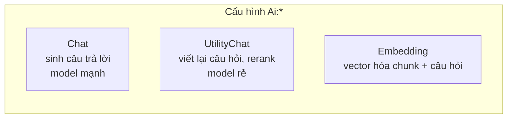

Chat provider và embedding provider **tách rời**, vì Anthropic không có API embedding:

```
Ai:Chat:Provider      = Anthropic   (claude-sonnet-5)
Ai:Embedding:Provider = OpenAI      (text-embedding-3-small)
```

### Đổi provider chạm vào đúng mấy file?

**Một.** `appsettings.json` (hoặc biến môi trường). Thêm một hãng **hoàn toàn mới** thì thêm
một file vào `Infrastructure/Ai/Providers/` (implement `IChatProviderClientFactory` hoặc
`IEmbeddingProviderClientFactory`) và một dòng đăng ký trong `AiServiceCollectionExtensions`.
`ChatClientFactory` và `EmbeddingGeneratorFactory` **không phải sửa** — chúng chỉ tra bảng theo
enum provider. Quên đăng ký sẽ fail `ProviderFactoryRegistryTests` ngay lúc chạy test.

### API key lấy từ đâu?

Key **bind thẳng vào `AiOptions` qua `IConfiguration`**, không có resolver riêng. Đặt
`Ai:Chat:ApiKey` và `Ai:Embedding:ApiKey` bằng nguồn cấu hình phù hợp với môi trường:

```bash
# dev trên máy
dotnet user-secrets set "Ai:Chat:ApiKey" "sk-..." --project src/IChat.Api

# container / CI (hai gạch dưới = dấu phân cách section)
Ai__Chat__ApiKey=sk-...
Ai__Embedding__ApiKey=sk-...
```

Chat và embedding dùng **hai key riêng**, vì thường là hai hãng khác nhau. Thiếu key thì
`AiOptionsValidator` chặn ngay lúc khởi động chứ không đợi tới câu hỏi đầu tiên của người dùng.
`/api/v1/providers` chỉ báo *có key hay chưa*, không bao giờ trả key ra.

```bash
docker compose --env-file .env.openai.example up      # OpenAI
docker compose --env-file .env.anthropic.example up   # Claude (chat) + OpenAI (embedding)
docker compose --env-file .env.gemini.example up      # Gemini (chat) + OpenAI (embedding)
```

Gemini đi qua endpoint **OpenAI-compatible** (`https://generativelanguage.googleapis.com/v1beta/openai/`)
để không phải phụ thuộc một package beta.

> ⚠️ Với Gemini, `Endpoint` phải set **tường minh** trong file env: docker-compose luôn truyền
> `Ai__*__Endpoint` xuống container dưới dạng chuỗi **rỗng** (chứ không phải null), nên nhánh
> `endpoint ?? default` trong factory không bao giờ chạy. Cảnh báo này được ghi thành comment
> ngay trong `GoogleChatClientFactory` và `GoogleEmbeddingClientFactory`.

### Middleware AI gắn một lần

`AiServiceCollectionExtensions.ApplyPipeline` bọc mọi `IChatClient` bằng cùng một chuỗi
middleware: `UseFunctionInvocation` (tùy chọn) → `UseDistributedCache` → `UseOpenTelemetry` →
`UseLogging`. Nhờ đó **mọi provider hành xử giống hệt nhau** về caching, telemetry, logging.

### Tham số RAG quan trọng (`appsettings.json`, section `Rag`)

| Nhóm | Khóa | Mặc định | Ý nghĩa |
| --- | --- | --- | --- |
| Chunking | `TargetTokens` / `OverlapTokens` / `MinTokens` | 800 / 120 / 80 | kích thước chunk |
| | `PrependHeadingPath` | `true` | thêm tiêu đề vào text đem embed |
| QueryRewriting | `Enabled` / `SkipOnFirstTurn` | `true` / `true` | |
| Retrieval | `VectorCandidates` / `FullTextCandidates` / `TrigramCandidates` | 40 / 40 / **0** | 0 = tắt nhánh |
| | `VectorMinSimilarity` / `FullTextMinRank` | 0.20 / 0.01 | ngưỡng lọc |
| | `RrfK` / `FusedTopK` | 60 / 20 | tham số fusion |
| Diversity | `MmrLambda` / `MaxChunksPerDocument` / `FinalTopK` | 0.7 / 3 / 8 | |
| NeighborExpansion | `Enabled` / `Before` / `After` | `true` / 1 / 1 | |
| Reranking | `Mode` | `None` | `None` \| `Llm` |
| Context | `MaxTokens` / `HistoryTurns` | 6000 / 6 | |

### ⚠️ Đổi model embedding — lỗi nguy hiểm nhất

Vector cũ và vector mới nằm ở **hai không gian khác nhau**. Tìm kiếm vẫn trả về kết quả,
nhưng kết quả **hoàn toàn sai**, và **không có gì báo lỗi**.

`EmbeddingModelGuard` (một `IHostedService`) so cấu hình với dữ liệu trong DB lúc khởi động:

- Lệch **model** → ghi log **warning**.
- Lệch **số chiều** → **fail fast**, từ chối khởi động app.

Quy trình đổi cho đúng:

1. Nếu số chiều mới khác 1536 → thêm migration đổi kiểu cột:
   ```bash
   dotnet ef migrations add ChangeEmbeddingDimensions -p src/IChat.Infrastructure
   # sửa migration: ALTER TABLE document_chunks ALTER COLUMN embedding TYPE vector(N)
   # và cập nhật EmbeddingDimensions.Default + ColumnType
   ```
2. `POST /api/v1/admin/reindex` để tính lại toàn bộ.

Đó cũng là lý do `.env.gemini.example` giữ embedding ở OpenAI: schema đang cố định
`vector(1536)`, trong khi `ProviderCapabilities.For(EmbeddingProvider.Google)` đặt
`SupportsEmbeddingDimensions = false` nên tham số `dimensions` không được gửi đi và
`gemini-embedding-001` sẽ trả về 3072 chiều.

---

## 12. Xử lý lỗi, degrade, health check

### Nguyên tắc: bước phụ hỏng thì degrade, không làm hỏng cả request

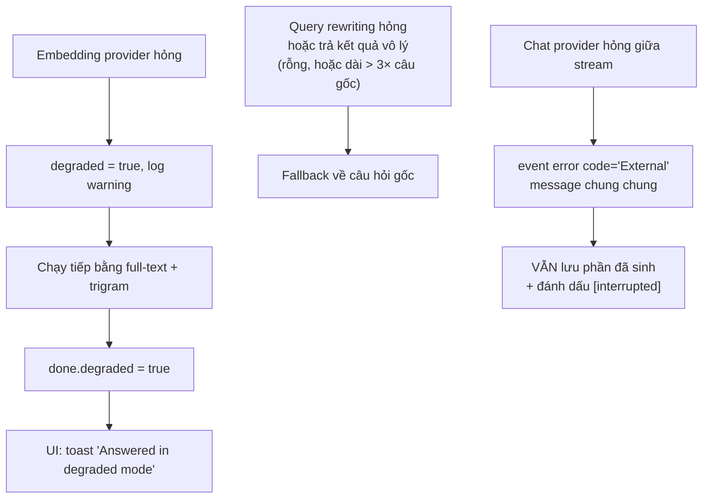

Message lỗi gốc của SDK **không bao giờ lọt ra client** — nó có thể lộ chi tiết cấu hình.
Client chỉ nhận `"The AI provider failed while generating the answer."`, còn chi tiết nằm trong log.

### Timeout

Timeout được thực thi **trong `ChatService`** bằng `CancellationTokenSource.CancelAfter`, chứ
không dựa vào HttpClient pipeline. Lý do: SDK của từng hãng do factory dựng trực tiếp nên
không đi qua `HttpClient` của mình — một provider treo sẽ giữ kết nối SSE mở **vô hạn**.

### Health check

| Endpoint | Kiểm | Dùng cho |
| --- | --- | --- |
| `/health/live` | không kiểm gì (`Predicate = _ => false`) | liveness probe — process còn sống? |
| `/health/ready` | `postgres` + `pgvector` + `ai-providers` | readiness probe — nhận traffic được chưa? |

Log của `/health` bị hạ xuống **Debug**, vì orchestrator poll liên tục sẽ nhấn chìm log thật.

### Rate limit

`POST /conversations/{id}/messages` dính fixed-window limiter `"chat"`:
**30 request / phút, QueueLimit = 0** (vượt là từ chối ngay, không xếp hàng).

### Lỗi ở phía UI

- `describeHttpError` biến ProblemDetails thành câu tiếng người.
- `ChatStore.conversationsError` phân biệt **"chưa có hội thoại nào"** với **"không gọi được API"** —
  không có nó thì sidebar sẽ nói "No conversations yet" trong khi thật ra API chết.
- Lượt chat lỗi **ở lại trên màn hình** kèm câu hỏi và nút gửi lại (`retry()`), thay vì biến mất
  im lặng và xóa trắng ô nhập.

---

## 13. Chạy thử và debug

### Chạy bằng Docker (nhanh nhất)

```bash
cd /Users/toannt/Documents/GitHub/ichat
docker compose --env-file .env.openai.example up
```

| | |
| --- | --- |
| UI | http://localhost:4200 |
| API | http://localhost:8080 |
| API reference (chỉ Development) | http://localhost:8080/docs |

```bash
curl localhost:8080/health/ready
curl localhost:8080/api/v1/providers
```

Chạy riêng backend: `docker compose up postgres api`.

### Chạy để dev

```bash
# terminal 1 — API (cổng 5140)
cd api && dotnet run --project src/IChat.Api

# terminal 2 — UI
cd ui && npm install && npm start      # http://localhost:4200
```

### Thứ tự debug khi "câu trả lời sai / không có"

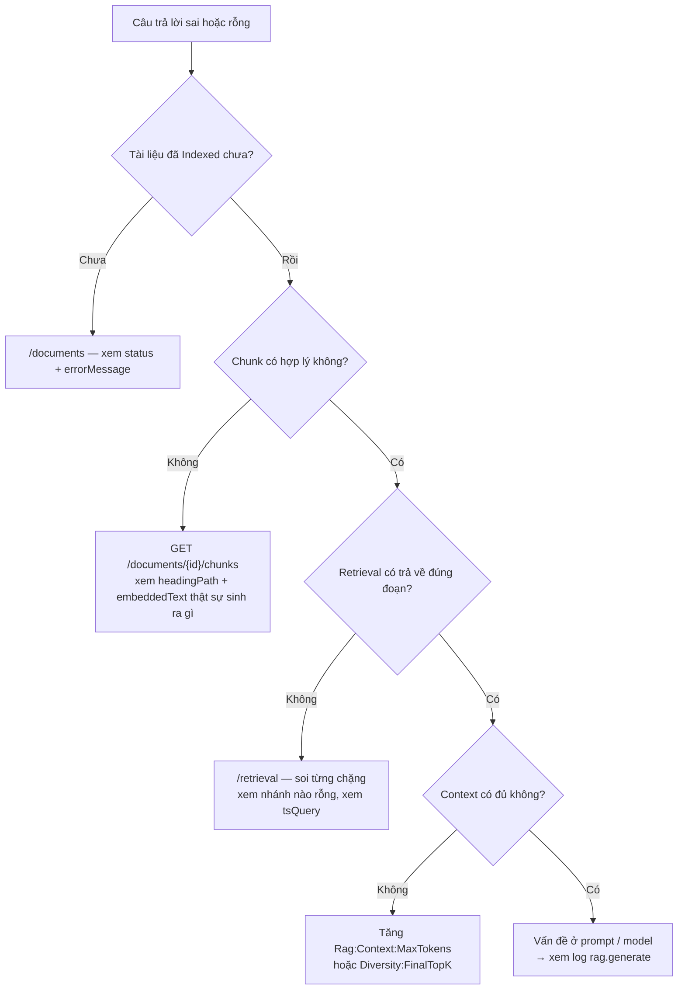

### Test

```bash
cd api
dotnet test                                        # unit + integration
dotnet test --filter "Category!=RequiresApiKey"    # bỏ contract test cần key thật

cd ../ui
npm test                                           # Vitest
```

Integration test dùng Testcontainers với image `pgvector/pgvector:pg17` và một fake AI client
tất định — **không cần API key, không gọi mạng**.

Bộ Postman/Newman chạy trên API sống (37 request, 202 assertion):

```bash
cd api
npx newman run postman/IChat.postman_collection.json \
    -e postman/IChat.local.postman_environment.json --working-dir postman
```

### Đo chất lượng retrieval

```bash
cd api
docker compose -f ../docker-compose.yml up -d postgres api
dotnet run --project tools/IChat.RagEval -- seed
dotnet run --project tools/IChat.RagEval -- eval
dotnet run --project tools/IChat.RagEval -- compare   # bật/tắt query rewriting
```

Golden set 29 câu, chia ba nhóm: `fact` (18), `multi-hop` (6), `followup` (5 — câu hỏi tiếp
nối chứa đại từ).

### Quan sát (observability)

OpenTelemetry trace theo các source: `IChat.Chat`, `IChat.UtilityChat`, `IChat.Embedding`,
`IChat.Rag`. Các span đáng chú ý:

```
rag.retrieve
├─ rag.rewrite            (tag: rag.rewritten)
├─ rag.branches
│  └─ rag.branch.vector
└─ rag.expand_neighbors   (tag: rag.context_blocks)
rag.generate              (tag: gen_ai.system, gen_ai.request.model, gen_ai.request.max_tokens)
```

Tag theo đúng OpenTelemetry semantic convention cho GenAI. Log ra JSON qua Serilog
(`CompactJsonFormatter`), mỗi request một dòng tổng kết.

---

## 14. Bảng tra cứu file

### Backend

| Việc cần làm | File |
| --- | --- |
| Bootstrap, middleware, telemetry, rate limit | `api/src/IChat.Api/Program.cs` |
| Gắn prefix version, đăng ký group | `api/src/IChat.Api/Endpoints/EndpointRouteBuilderExtensions.cs` |
| Endpoint chat SSE | `api/src/IChat.Api/Endpoints/Conversations/V1/ConversationEndpoints.cs` |
| Endpoint upload/list/delete tài liệu | `api/src/IChat.Api/Endpoints/Documents/V1/DocumentEndpoints.cs` |
| Endpoint search debug | `api/src/IChat.Api/Endpoints/Search/V1/SearchEndpoints.cs` |
| Endpoint providers + reindex | `api/src/IChat.Api/Endpoints/Admin/V1/AdminEndpoints.cs` |
| **Mạch truyện SSE của một lượt chat** (Facade) | `api/src/IChat.Core/Services/ChatService.cs` |
| Dựng ngữ cảnh: history, viết lại, retrieval, ghép context | `api/src/IChat.Core/Services/Chat/ChatTurnContextBuilder.cs` |
| Gọi model, timeout, buffer câu trả lời | `api/src/IChat.Core/Services/Chat/AnswerGenerator.cs` |
| Lưu message + citation | `api/src/IChat.Core/Services/Chat/ChatTurnRecorder.cs` |
| **Pipeline retrieval** | `api/src/IChat.Core/Rag/RetrievalPipeline.cs` |
| Thuật toán RRF | `api/src/IChat.Core/Rag/ReciprocalRankFusion.cs` |
| Thuật toán MMR | `api/src/IChat.Core/Rag/MaximalMarginalRelevance.cs` |
| Mở rộng chunk hàng xóm | `api/src/IChat.Core/Rag/NeighborExpansion.cs` |
| Ghép context theo ngân sách token | `api/src/IChat.Core/Rag/ContextAssembler.cs` |
| **Prompt (system prompt, rewrite prompt)** | `api/src/IChat.Core/Rag/PromptBuilder.cs` |
| Xác minh marker `[n]` | `api/src/IChat.Core/Rag/CitationExtractor.cs` |
| Toàn bộ tham số RAG | `api/src/IChat.Core/Rag/RagOptions.cs` + `appsettings.json` |
| **Nơi duy nhất biết tên hãng LLM** (mỗi hãng một file) | `api/src/IChat.Infrastructure/Ai/Providers/` |
| Cửa vào chọn hãng theo config | `api/src/IChat.Infrastructure/Ai/ChatClientFactory.cs`, `EmbeddingGeneratorFactory.cs` |
| Wiring AI + middleware chung | `api/src/IChat.Infrastructure/Ai/AiServiceCollectionExtensions.cs` |
| Viết lại câu hỏi | `api/src/IChat.Infrastructure/Ai/LlmQueryRewriter.cs` |
| Chặn đổi nhầm model embedding | `api/src/IChat.Infrastructure/Ai/EmbeddingModelGuard.cs` |
| **SQL của 3 nhánh tìm kiếm + nạp chunk** | `api/src/IChat.Infrastructure/Search/PostgresChunkStore.cs` |
| Từng nhánh tìm kiếm (Strategy) | `api/src/IChat.Infrastructure/Search/Branches/` |
| Dựng tsquery kiểu OR + bỏ dấu | `api/src/IChat.Infrastructure/Search/TsQueryBuilder.cs` |
| Worker xử lý nền | `api/src/IChat.Infrastructure/Ingestion/DocumentIngestionWorker.cs` |
| Cắt chunk theo heading | `api/src/IChat.Infrastructure/Ingestion/HeadingAwareChunker.cs` |
| Parser docx (tracked changes, text box, bảng) | `api/src/IChat.Infrastructure/Ingestion/Parsing/DocxDocumentParser.cs` |
| Nhận diện format theo đuôi + magic bytes | `api/src/IChat.Infrastructure/Ingestion/Parsing/DocumentParserResolver.cs` |
| Từ chối `.doc` kèm hướng dẫn | `api/src/IChat.Infrastructure/Ingestion/Parsing/LegacyDocFormatDetector.cs` |
| Schema + index + `immutable_unaccent` | `api/src/IChat.Infrastructure/Persistence/Migrations/20260827134553_InitialSchema.cs` |

### Frontend

| Việc cần làm | File |
| --- | --- |
| Route | `ui/src/app/app.routes.ts` |
| Provider toàn app (zoneless, fetch, icons) | `ui/src/app/app.config.ts` |
| **State màn hình chat** | `ui/src/app/features/chat/chat.store.ts` |
| Client SSE + map event | `ui/src/app/core/api/conversations.api.ts` |
| **Đọc wire format SSE** | `ui/src/app/core/api/sse.ts` |
| Kiểu dữ liệu API | `ui/src/app/core/api/api.models.ts` |
| State màn hình tài liệu (poll 3s) | `ui/src/app/features/documents/documents.store.ts` |
| State retrieval lab | `ui/src/app/features/retrieval/retrieval.store.ts` |
| Render markdown đã sanitise | `ui/src/app/shared/markdown/markdown.ts`, `answer-content.ts` |
| Cấu hình proxy dev | `ui/proxy.conf.json` |
| Cấu hình proxy trong container | `ui/nginx.conf`, `ui/nginx-proxy.inc` |

### Gốc repo

| File | Nội dung |
| --- | --- |
| `docker-compose.yml` | 3 service + 2 volume |
| `.env.openai.example` / `.env.anthropic.example` / `.env.gemini.example` | preset provider |

---

## 15. Vài điểm cần lưu ý

Những chỗ đã đọc code và thấy đáng để người mới biết trước:

1. **Tên chặng trong Retrieval Lab lệch nhau.** `RetrievalStore.STAGE_ORDER` (frontend) liệt kê
   `'fusion'`, `'mmr'`, `'neighbors'`, `'rerank'`, nhưng backend phát ra `'fused'`, `'afterMmr'`,
   `'reranked'` và **không có** chặng `'rewrite'` hay `'neighbors'` riêng. Store vẫn render các
   chặng đó (nhóm `extra` được nối vào cuối), nên **không mất dữ liệu** — nhưng thứ tự hiển thị
   là `vector, fulltext, trigram, final, fused, afterMmr, reranked` thay vì đúng thứ tự pipeline.
   Sửa thì đổi `STAGE_ORDER` cho khớp tên backend.

2. **Hàng đợi ingestion là in-process.** Restart container `api` khi đang có tài liệu ở
   `Pending`/`Processing` thì tài liệu đó kẹt lại vĩnh viễn ở trạng thái đó. Cách gỡ:
   `POST /api/v1/admin/reindex`.

3. **`Database:AutoMigrate` mặc định `true` trong docker-compose** nhưng `false` trong
   `appsettings.json`. Production nên chạy `dotnet ef database update` thay vì tự migrate lúc khởi động.

4. **Chưa có xác thực.** `user_id` tồn tại trong bảng `conversations` và có thể lọc theo query
   param, nhưng không có tầng auth nào — bất kỳ ai gọi được API đều đọc được mọi hội thoại.

5. **Rerank mặc định tắt** (`Reranking:Mode = "None"`). Bật `"Llm"` sẽ tốn thêm một round-trip
   tới utility model cho mỗi truy vấn. Mode Cohere/Voyage chưa được cài — nếu cấu hình giá trị lạ,
   nó degrade về `NoOpReranker` chứ không ném lỗi.

6. **Nhánh trigram mặc định tắt** (`TrigramCandidates = 0`), dù index GIN trigram vẫn được tạo
   sẵn trong migration. Bật lên bằng cách đặt một số > 0.

---

*Tài liệu này viết dựa trên code tại nhánh `main`, ngày 2026-08-29.*
