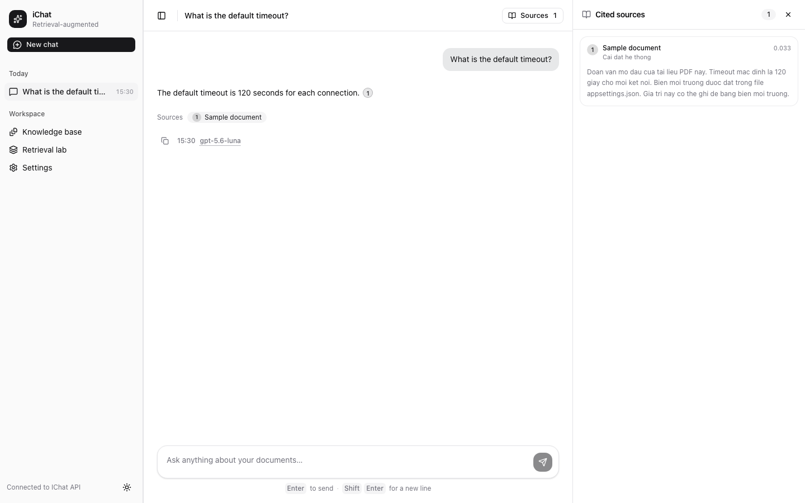
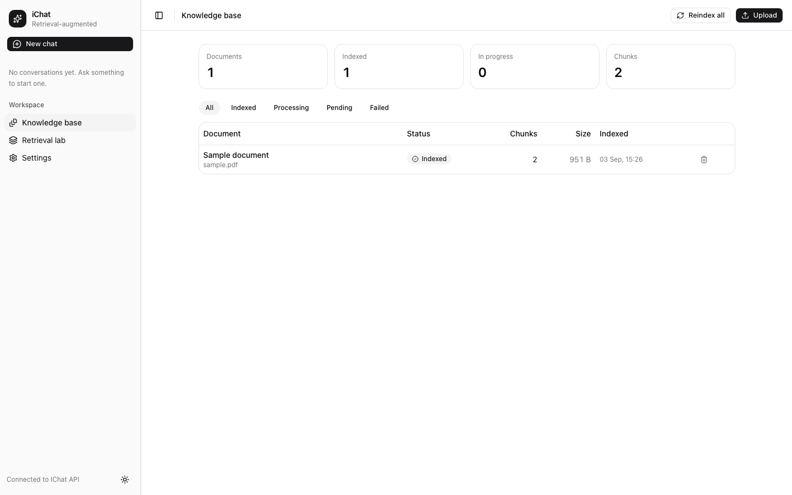
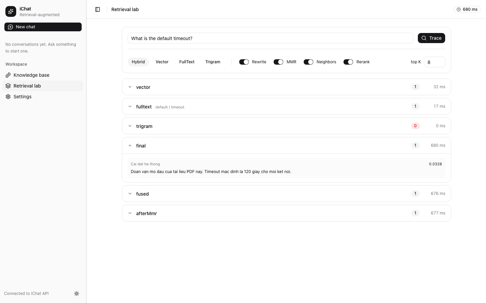
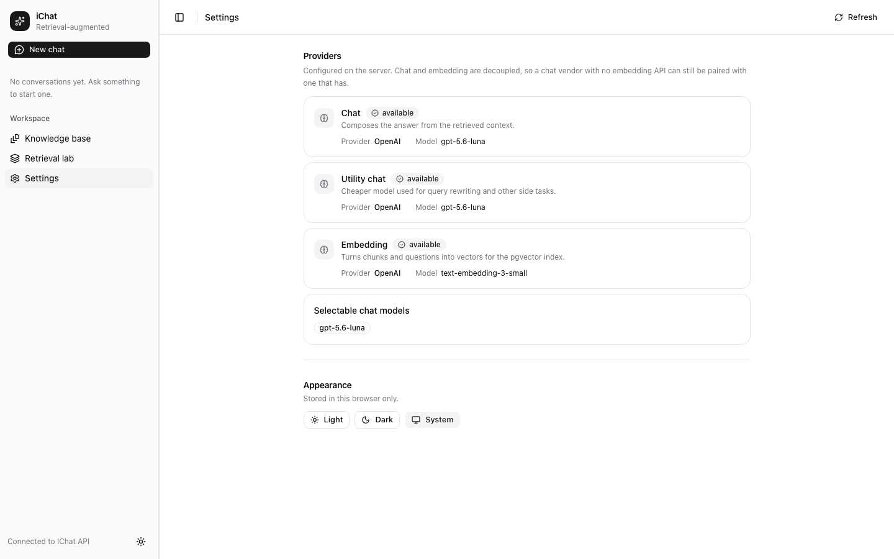

# iChat

A retrieval-augmented chat application: ask questions in natural language and get
answers composed **only** from your own indexed documents, with every claim carrying
a citation you can open and verify.

.NET 10 API + PostgreSQL/pgvector, Angular UI, LLM providers swappable by configuration alone.



## How it works

### 1. Ask a question, get a cited answer

Answers are composed from retrieved context, never from the model's own memory. Inline
markers link each statement back to the chunk it came from, and the **Cited sources**
panel shows the source heading and relevance score for each one. When the knowledge base
has nothing relevant, iChat says so instead of inventing an answer.

Behind a single question:

```
Question ─► rewrite ─► ┌─ vector ───┐
                       ├─ full-text ┼─► RRF ─► MMR ─► rerank ─► neighbors ─► context ─► LLM ─► SSE
                       └─ trigram ──┘
```

Two details decide whether those citations mean anything:

- **Retrieval uses a rewritten question, generation uses the original one.** A follow-up like
  *"what about that one?"* is resolved against the conversation history before it is embedded,
  because pronouns are invisible to an embedding model. The answer is still generated from what
  the user actually typed, so it never drifts to a question nobody asked. Rewriting is skipped
  on the first turn — there is no pronoun to resolve yet.
- **Sources and citations are not the same set.** *Sources* is everything that entered the
  context; *citations* is what the answer genuinely pointed at. The `[n]` markers a model emits
  are not trusted: once streaming ends they are parsed, markers out of range or inside code
  blocks are dropped, and only the survivors are stored.

### 2. Build the knowledge base



Upload `pdf`, `docx`, `md` or `txt`. A background worker parses each file, splits it with a
heading-aware chunker, embeds the chunks in batches and writes them to pgvector. The table
tracks per-document status (indexed / processing / pending / failed) and chunk counts, so a
document that failed to parse is visible rather than silently missing from answers, and the
counters across the top say how much of the corpus is actually searchable right now.

**Reindex all** re-queues every document from scratch — the escape hatch after changing the
chunker or the embedding model, since old and new vectors live in different spaces and mixing
them degrades search without reporting a single error.

### 3. Inspect the retrieval pipeline



The **Retrieval lab** runs a question through the pipeline and reports what every stage
produced and how long it took — so you can see exactly where a chunk stopped surviving.
Switch between hybrid, vector, full-text and trigram retrieval, toggle query rewriting, MMR,
neighbor expansion and reranking, and change top-K, then compare the resulting candidate
sets and scores.

Each branch is there because the other two are blind to something:

| Branch | Good at | Blind to |
| --- | --- | --- |
| Vector | meaning and paraphrase — *"leave policy"* ↔ *"paid days off"* | exact codes, identifiers, proper nouns |
| Full-text | exact keywords, identifiers, names | paraphrase |
| Trigram | typos and near-misses | noise — off by default (`TrigramCandidates = 0`) |

They run in parallel, then **RRF** fuses the ranked lists by position (fusion, not reranking —
it never re-scores relevance), **MMR** drops near-duplicates (λ 0.7, at most 3 chunks per
document), an optional **rerank** pass re-scores whatever survived, and only then does
**neighbor expansion** pull the chunk before and after each hit, so a match cut mid-sentence
still reads as a whole thought.

In the screenshot above, vector and full-text each surfaced the one matching chunk while
trigram returned none, and the `default | timeout` beside the full-text stage is the `tsquery`
actually sent to Postgres.

Read the timings carefully, because the two kinds are not comparable. A branch reports **its own
SQL** — 32 ms and 17 ms — while `fused`, `afterMmr` and `final` are **cumulative** from the start
of retrieval. The gap up to 680 ms is therefore spent outside Postgres, mostly on the
query-embedding round-trip, which the vector branch makes *before* its stopwatch starts. And
there is no `reranked` row at all: the toggle is on, but `Reranking:Mode` is `None` by default,
so the stage never ran. None of that is visible from the chat window.

### 4. Swap providers without touching code



Chat and embedding providers are configured **separately**, because some vendors (Anthropic)
have no embedding API — so a chat vendor can be paired with an embedding vendor that does.
A third "utility chat" slot runs the cheaper side tasks like query rewriting. Settings reports
which providers are available and which models are selectable; keys live on the server and are
never returned to the browser, not even masked.

## Under the hood

| Layer | Choice |
| --- | --- |
| API | .NET 10 minimal APIs. No MediatR, no AutoMapper, no generic repository — one service per area, `Result<T>` instead of exceptions for business failures, RFC 7807 errors carrying a `traceId` |
| Data | PostgreSQL 17 with `vector`, `pg_trgm` and `unaccent`; EF Core migrations |
| AI | `Microsoft.Extensions.AI` abstractions; each vendor is one file under `Infrastructure/Ai/Providers/`, and one middleware chain (cache → telemetry → logging) wraps them all so every provider behaves identically |
| UI | Angular 22 standalone, **zoneless**, signals only — no NgRx; spartan/ui components vendored into the repo, Tailwind v4 |
| Streaming | SSE over `fetch`, with a hand-rolled reader — the chat endpoint is a POST, so `EventSource` is out |
| Telemetry | OpenTelemetry spans under the GenAI semantic conventions, Serilog JSON logs |

### The streaming contract

One answer is one SSE stream — four event types on the happy path, plus one for failure:

| Event | Payload | What the UI does |
| --- | --- | --- |
| `status` | `rewriting` \| `retrieving` \| `generating` | shows which stage is running, so the screen is never silently still |
| `sources` | everything that entered the context | renders the sources panel *before* the first word arrives |
| `delta` | a text fragment | appends to the streaming answer |
| `done` | citations, provider, model, tokens, latency, `degraded`, `interrupted` | closes the turn |
| `error` | `{ code, message }` | shows the failure inline, with a retry button |

Errors arrive as an `error` event on HTTP **200**, not as a 4xx/5xx: the response headers are
already on the wire before anything can fail, so the status code cannot be taken back mid-stream.
Provider error text never reaches the browser — it can leak configuration — and stays in the logs.

Deltas are buffered and flushed on `requestAnimationFrame`. A fast provider emits tokens far
quicker than the screen refreshes, and the answer is re-parsed as markdown on every change.

### Failures degrade instead of cascading

- Embedding provider down → the vector branch drops out, full-text still answers, and
  `degraded: true` reaches the UI as a toast rather than an error.
- Query rewriting fails or returns something implausible → fall back to the original question.
- Chat provider dies mid-stream, or the user hits **Stop** → whatever was generated is still
  persisted and marked `[interrupted]`. The write deliberately runs with `CancellationToken.None`,
  since the request's own token is already cancelled by then.

Health checks split the two questions an orchestrator asks: `/health/live` (is the process up?)
checks nothing, `/health/ready` checks Postgres, pgvector and the AI providers. Sending a message
is rate-limited to 30 per minute with no queue.

The browser only ever talks to one origin: nginx in the `ui` container proxies `/api` and
`/health` to the API, so the backend has **no CORS configuration at all**. `proxy_buffering off`
in that config is load-bearing — with buffering on, nginx holds the SSE frames until the response
ends and the answer lands in one lump instead of streaming.

## Quick start

Pick a provider set, copy it, fill in the real API keys — the `.example` files ship with
placeholders, and every `.env*` file except the examples is gitignored:

```bash
cp .env.openai.example    .env.local   # OpenAI
cp .env.anthropic.example .env.local   # Claude (chat) + OpenAI (embedding)
cp .env.gemini.example    .env.local   # Gemini (chat) + OpenAI (embedding)

docker compose --env-file .env.local up
```

| | |
| --- | --- |
| UI | <http://localhost:4200> |
| API | <http://localhost:8080> |
| API reference (Development only) | <http://localhost:8080/docs> |

Check it with `curl localhost:8080/health/ready` and `curl localhost:8080/api/v1/providers`.
Run just the backend with `docker compose up postgres api`.

```
/health/live, /health/ready     infrastructure, unversioned
/api/v1/documents…              upload, list, read chunks, delete
/api/v1/conversations…          history, and the SSE chat endpoint
/api/v1/search                  the retrieval pipeline without an answer — what the lab calls
/api/v1/providers               which providers and models are live
/api/v1/admin/reindex           re-queue every document
```

## Tuning

Retrieval behaviour lives in `appsettings.json` under `Rag`, not in code:

| Section | Key | Default |
| --- | --- | --- |
| `Chunking` | `TargetTokens` / `OverlapTokens` / `MinTokens` | 800 / 120 / 80 |
| `QueryRewriting` | `Enabled` / `SkipOnFirstTurn` | `true` / `true` |
| `Retrieval` | `VectorCandidates` / `FullTextCandidates` / `TrigramCandidates` | 40 / 40 / **0** |
| | `VectorMinSimilarity` / `FullTextMinRank` | 0.20 / 0.01 |
| | `RrfK` / `FusedTopK` | 60 / 20 |
| `Diversity` | `MmrLambda` / `MaxChunksPerDocument` / `FinalTopK` | 0.7 / 3 / 8 |
| `NeighborExpansion` | `Enabled` / `Before` / `After` | `true` / 1 / 1 |
| `Reranking` | `Mode` | `None` (or `Llm`) |
| `Context` | `MaxTokens` / `HistoryTurns` | 6000 / 6 |

Change one, then measure it — the retrieval lab shows the effect on a single question, and
`IChat.RagEval` below scores it across the whole golden set.

## Tests and evaluation

Every command here is run from the repository root:

```bash
(cd api && dotnet test)   # unit + integration; Testcontainers pgvector, fake AI client, no key needed
(cd ui  && npm test)      # Vitest
```

A Postman collection — 35 requests over ingestion, search, SSE and the error paths — runs against
a live API rather than a fake one:

```bash
npx newman run api/postman/IChat.postman_collection.json \
    -e api/postman/IChat.local.postman_environment.json --working-dir api/postman
```

Retrieval quality gets measured rather than guessed. `IChat.RagEval` seeds a sample corpus,
scores retrieval against a golden set, and diffs two configurations against each other:

```bash
# talks to the API over HTTP; override the host with ICHAT_URL (default http://localhost:8080)
dotnet run --project api/tools/IChat.RagEval seed      # upload and index the corpus
dotnet run --project api/tools/IChat.RagEval           # score against golden-set.json
dotnet run --project api/tools/IChat.RagEval compare   # e.g. query rewriting on vs off
```

## Housekeeping

`scripts/cleanup-postgres.sh` clears documents and/or conversations out of the database. It is
a dry run by default — it prints the rows it *would* delete and touches nothing until
`--execute`:

```bash
scripts/cleanup-postgres.sh                                   # count everything, delete nothing
scripts/cleanup-postgres.sh --target documents --older-than 30
scripts/cleanup-postgres.sh --target all --older-than 7 --execute
```

It runs `psql` inside the compose `postgres` service, or against `DATABASE_URL` when that is set.

## Repository layout

| Path | What's in it |
| --- | --- |
| [`api/`](api/README.md) | .NET solution — `IChat.Core` (domain), `IChat.Infrastructure` (persistence + providers), `IChat.Api` (HTTP host), plus test suites |
| [`ui/`](ui/README.md) | Angular workspace — chat, knowledge base, retrieval lab and settings |
| `scripts/` | Operational helpers — `cleanup-postgres.sh` |
| `docker-compose.yml` | Postgres (pgvector) + API + UI |
| `IChat.md` | Design document — the full frontend-to-backend walkthrough (Vietnamese) |

Dependencies point inward only:

```
Api  ──►  Infrastructure  ──►  Core
```

Core knows nothing about OpenAI, Anthropic or Google — adding a vendor touches configuration
and one factory under `Infrastructure/Ai/Providers/`.

See [`api/README.md`](api/README.md) for the backend in depth, including the retrieval traps
already handled (full-text `tsquery` construction, `unaccent()` immutability) and how API keys
bind through configuration.

## Known limitations

Worth knowing before this runs anywhere real:

- **No authentication.** `user_id` exists on conversations and can be filtered by query
  parameter, but nothing enforces it — anyone who can reach the API can read every conversation.
- **The ingestion queue is in-process.** Restarting the API while a document sits in
  `Pending` / `Processing` strands it there; `POST /api/v1/admin/reindex` is the way out.
- **Reranking is off by default.** `Llm` mode costs an extra round-trip per query. `Cohere` and
  `Voyage` exist in the `RerankMode` enum but have no implementation behind them — selecting one
  binds successfully and then falls through to a no-op reranker, so retrieval quietly runs
  unreranked instead of failing at startup.
- **The trigram branch is off by default**, though its GIN index is created either way. Set
  `TrigramCandidates` above 0 to switch it on.
- **`Database:AutoMigrate` differs per environment** — `true` in docker-compose and in
  `appsettings.Development.json`, `false` in the base `appsettings.json`. Anything
  production-shaped should run `dotnet ef database update` rather than migrate at startup.
- **Embedding dimensions are pinned to `vector(1536)` by the schema.** That is why the Gemini
  example keeps embeddings on OpenAI: `gemini-embedding-001` returns 3072 dimensions.
